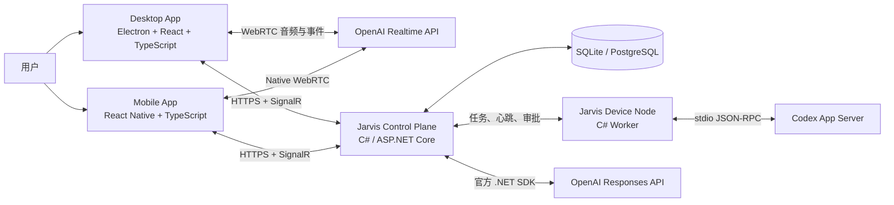
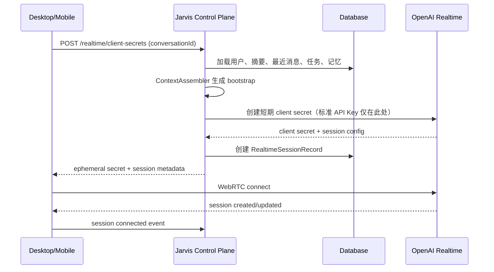
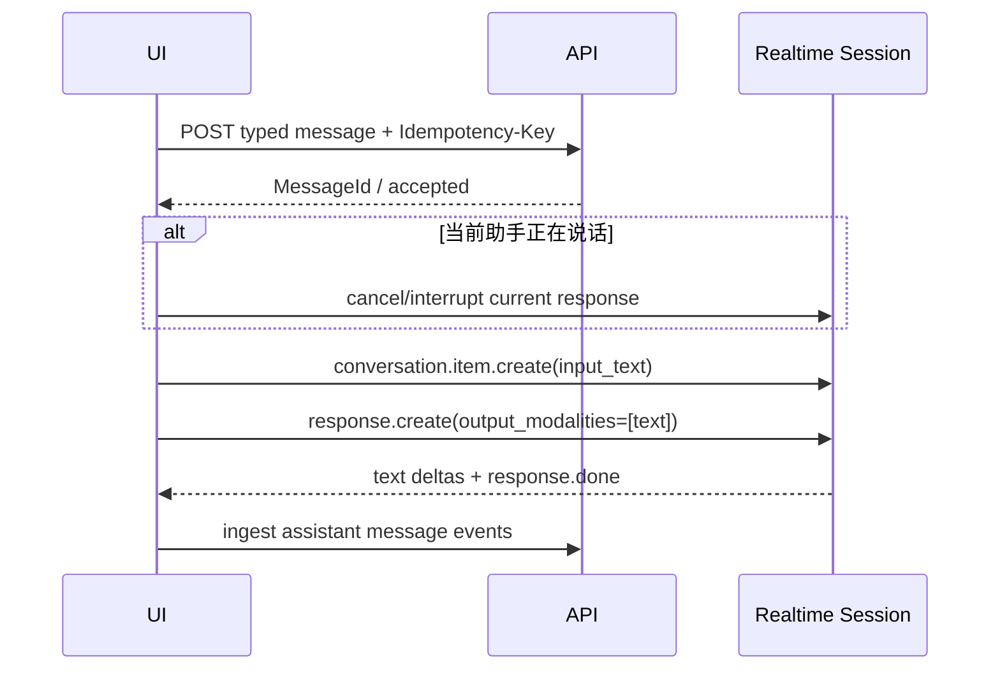
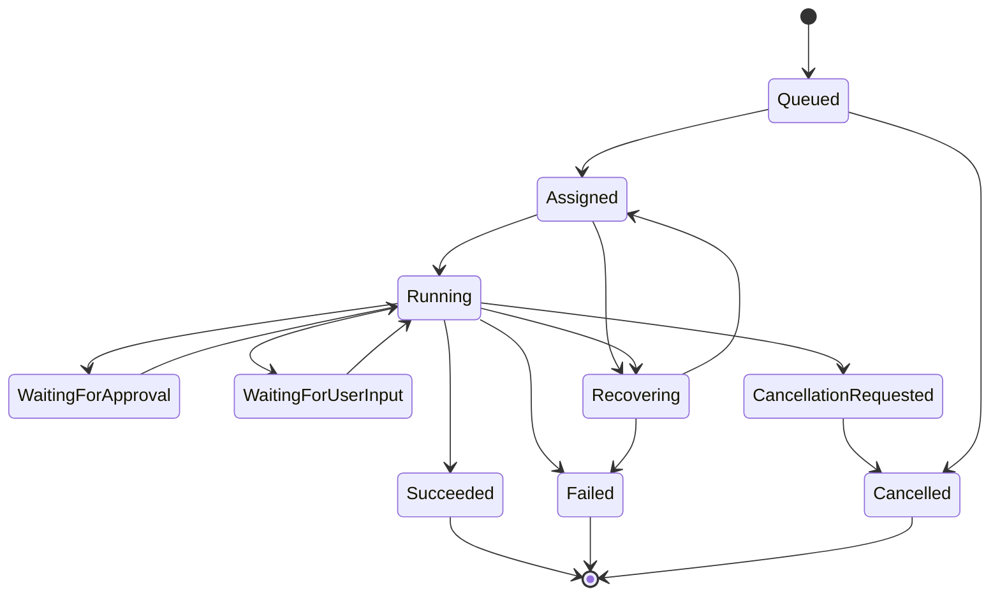
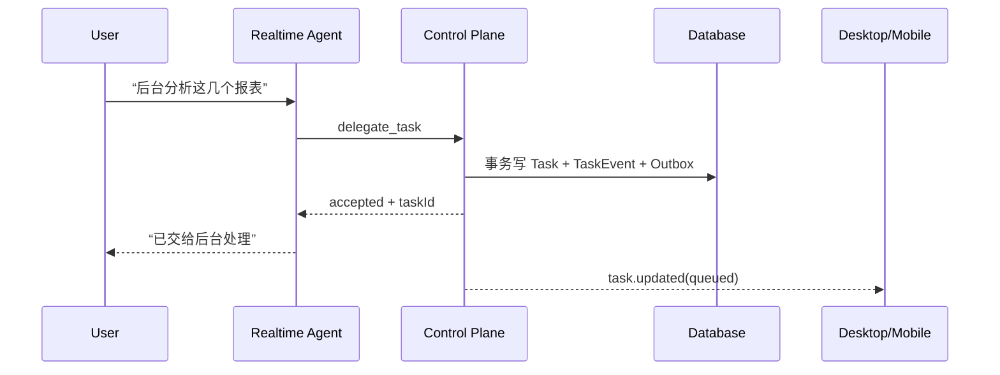
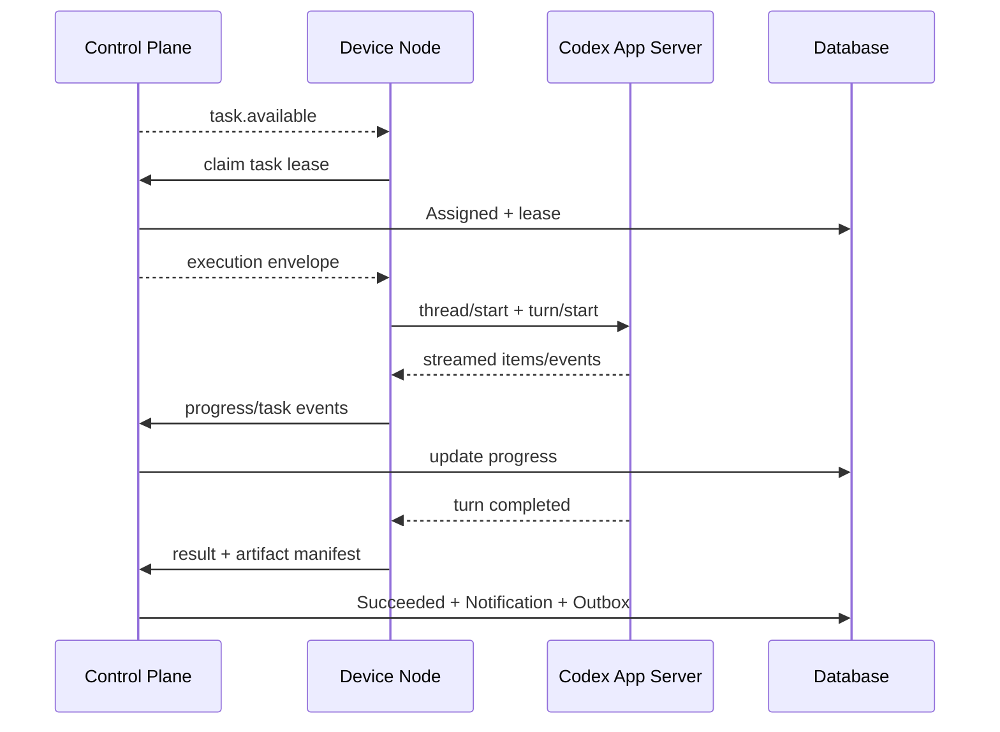
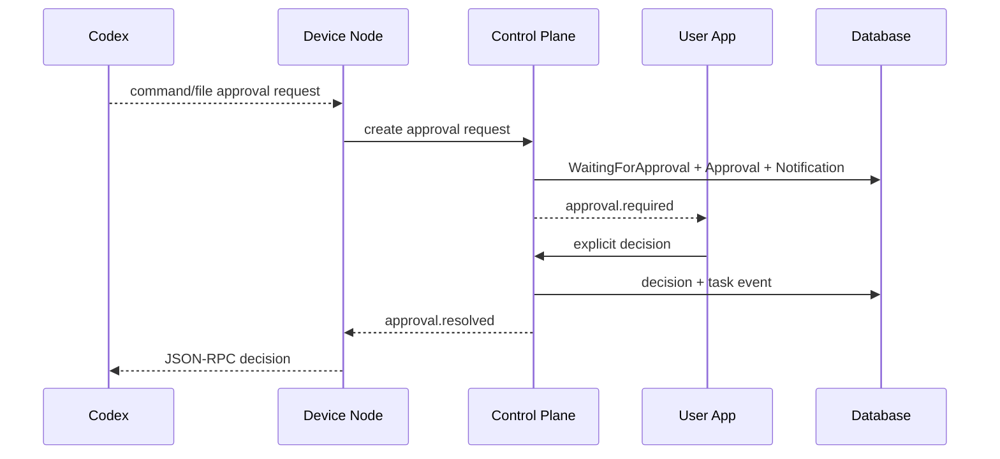
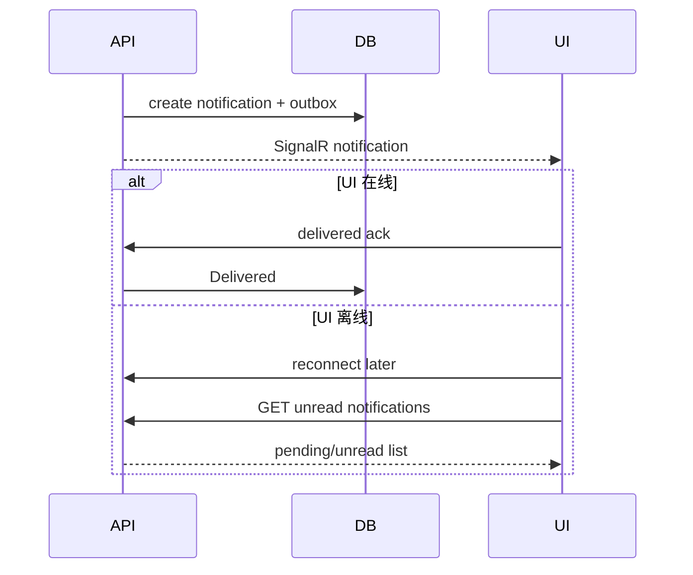

# Jarvis V1 完整架构设计与 Codex 执行规范

> 文档版本：1.0  
> 编制日期：2026-08-24  
> 目标读者：Codex、后端工程师、桌面端工程师、移动端工程师  
> 状态：**可执行基线（Implementation Baseline）**

---

## 0. 文档用途

本文件不是概念性方案，而是 Jarvis V1 的**架构基线、实现边界、接口契约、数据模型、阶段计划与验收标准**。

Codex 接收到本文件后，应按本文的阶段顺序执行，不得擅自将项目改造成：

- 运维助手或纯编程助手；
- 仅支持语音、不支持文字输入的应用；
- 语音与文字相互独立的两套会话；
- Node.js 或 Python 主后端；
- C# 桌面 UI 或 C# 手机 UI；
- 由 Codex App Server 承担主会话、主记忆或主任务数据库的系统；
- 包含日历、定时提醒、周期任务的系统；
- 在应用退出后仍保证系统级 Push 的通知系统。

本文所有标记为“锁定”的决策，除非出现官方 API 已移除、当前运行环境不支持或存在明确安全问题，否则不得修改。确需变更时，必须先新增 ADR，并在阶段报告中说明原因、备选方案和影响。

---

# 1. 产品目标

Jarvis V1 是一个面向个人使用的全天候生活助手基础版本，首要目标是建立下面这条完整链路：

```text
实时语音 / 文字输入
        ↓
同一段助手会话理解上下文
        ↓
即时回答，或把复杂工作委派给后台
        ↓
后台通过 Responses API、C# 工具或 Codex 完成任务
        ↓
任务完成、失败或需要确认时，在助手应用中弹出通知
```

## 1.1 V1 必须具备

1. 实时语音输入和语音回答。
2. 文字输入下达指令。
3. 语音和文字使用同一个逻辑会话，能够理解“刚才那个”“继续上一个”等跨模态指代。
4. 文字输入默认只返回文字，不突然播放语音。
5. 语音输入默认返回语音，同时保存可读文本记录。
6. 用户在助手说话时可以语音打断。
7. 用户发送文字时，可以中止当前正在播放或生成的语音回答。
8. 简单问题由实时 Agent 直接回答。
9. 复杂任务被快速委派给后台，不阻塞实时会话。
10. 后台任务具有可持久化状态、取消、失败恢复、结果和审计记录。
11. 本地文件、命令、代码和复杂电脑任务可交给 Codex App Server。
12. 纯文本深度推理、总结、路由等任务可交给 OpenAI Responses API。
13. 任务完成、失败、需要审批或需要补充信息时，向正在运行的助手应用推送应用内通知。
14. 桌面端和手机端 UI 均不使用 C#。
15. 主后端使用 C#/.NET。
16. OpenAI 标准 API Key 只存在于可信后端，不进入桌面渲染进程或手机应用包。
17. Realtime Session 断线、轮换或超过时限后，逻辑 Conversation 仍可继续。
18. 后端、UI 或 Codex 进程异常重启后，不丢失已经确认写入的任务和通知。

## 1.2 V1 明确不做

- 日历读取与写入；
- 定时提醒；
- 周期性任务；
- Cron、Quartz 或 Hangfire 调度；
- 操作系统级 Push、APNs、FCM；
- 助手应用完全退出后的通知保证；
- 全天麦克风监听；
- 本地唤醒词；
- 智能家居；
- 自动付款、自动下单；
- 无审批的高风险外部写操作；
- 多租户 SaaS；
- 复杂向量数据库或知识图谱；
- 自研语音识别和语音合成链路；
- 让音频流经 C# 后端转发；
- 第一版强依赖 Microsoft Agent Framework、Semantic Kernel、AutoGen 或第三方 Agent 框架。

---

# 2. 锁定技术决策

| 领域 | 锁定决策 |
|---|---|
| 主后端 | C# / .NET 10 LTS / ASP.NET Core 10 |
| 数据访问 | EF Core 10 |
| V1 数据库 | SQLite |
| 多设备正式部署 | PostgreSQL，保持领域模型与接口不变 |
| 实时客户端推送 | ASP.NET Core SignalR |
| OpenAI 后端 SDK | 官方 OpenAI .NET SDK |
| 实时语音与实时文字 | OpenAI Realtime API + OpenAI Agents SDK for TypeScript |
| 桌面 UI | Electron + React + TypeScript |
| 手机 UI | React Native + TypeScript |
| 桌面实时传输 | WebRTC |
| Realtime 控制方式（V1） | 客户端 `RealtimeSession` + 薄工具调用 C# API；暂不引入后端 sideband |
| 手机实时传输 | React Native 自有 `RealtimeTransportLayer` + 原生 WebRTC |
| 后台本地执行 | Codex App Server，由 C# Device Node 通过 stdio JSON-RPC 控制 |
| 后台非本地推理 | Responses API，由 C# 后端调用 |
| 通知 | 数据库持久化 + Outbox + SignalR + 应用内弹窗 |
| 主会话事实来源 | C# 后端数据库，不是 Realtime Session，不是 Codex Thread |
| 主任务事实来源 | C# 后端数据库，不是内存队列，不是 Codex Thread |
| 代码组织 | 模块化单体 + 外部执行节点；不使用微服务拆分 V1 |
| C# 架构风格 | Feature folders + 清晰边界；不使用泛型 Repository；不过度接口化 |
| 时间存储 | UTC Unix 毫秒或明确转换后的 UTC 值，避免 SQLite 时间排序差异 |
| JSON | `System.Text.Json`，HTTP/SignalR 合同统一 camelCase |
| ID | 后端生成 UUIDv7/`Guid.CreateVersion7()`，客户端请求另带幂等键 |
| 可观测性 | OpenTelemetry + 结构化日志 + 关联 ID |
| API 描述 | OpenAPI，TypeScript 客户端合同由 OpenAPI 生成 |

## 2.1 为什么主后端保留 C#

C# 在本项目真正需要的后端能力上生态完整：

- ASP.NET Core API；
- SignalR 双向实时推送；
- `BackgroundService` / Worker Service；
- EF Core 与 SQLite/PostgreSQL；
- 成熟的进程管理、取消、并发和依赖注入；
- 官方 OpenAI .NET SDK；
- OpenTelemetry；
- Windows Service、systemd 和 launchd 部署能力。

实时音频、WebRTC、麦克风权限和跨端 UI 由 TypeScript 客户端承担，因此不需要为了 Realtime 高层生态而把可靠后端换成 Node.js 或 Python。

---

# 3. 核心架构原则

## 3.1 一个逻辑 Conversation，两种输入

```text
语音输入 ─┐
          ├── 同一个逻辑 Conversation
文字输入 ─┘
```

语音和文字不得创建两个独立 Agent、两套历史或两套长期摘要。

一个逻辑 `Conversation` 可以包含多个短生命周期的 `RealtimeSession`：

```text
Conversation A
├── RealtimeSession A1
├── RealtimeSession A2
├── RealtimeSession A3
└── 持久化消息、摘要、任务和记忆
```

## 3.2 Realtime 负责“当下交流”，C# 负责“真实状态”

Realtime Agent 负责：

- 低延迟语音交流；
- 当前短期上下文；
- 语音打断；
- 文字输入；
- 判断立即回答还是委派后台；
- 使用极少量前台工具。

C# 后端负责：

- 会话持久化；
- 上下文摘要；
- 长期偏好和显式记忆；
- 任务状态；
- 权限与审批；
- 通知；
- Codex 和 Responses 编排；
- 设备身份；
- 幂等、恢复和审计。

## 3.3 长任务不得阻塞实时会话

Realtime 工具调用只负责创建后台任务，必须快速返回：

```json
{
  "accepted": true,
  "taskId": "...",
  "status": "queued"
}
```

实时 Agent 随即告诉用户任务已接收。任务完成后通过通知交付结果。

## 3.4 Codex 是执行器，不是 Jarvis 本身

Codex 不拥有：

- 用户主会话；
- 用户身份；
- 长期记忆；
- 通知；
- 调度；
- 最终审批权；
- 任务是否完成的业务判定。

Codex 只接收一个受限任务、工作目录、权限配置和上下文，执行后返回事件、结果和产物。

## 3.5 所有副作用必须通过 C# 后端权限边界

浏览器或手机中的 Realtime 工具只能作为薄代理调用后端。不得在前端保存外部服务长期凭据，也不得从前端直接调用 Codex。

## 3.6 先持久化，再确认成功

对以下操作，只有数据库事务成功后才能向客户端返回成功：

- 文字消息接受；
- 任务创建；
- 审批决定；
- 通知创建；
- 任务状态终态写入。

---

# 4. 质量属性与目标指标

这些指标是 V1 的工程目标，用于测试和观测，不代表外部服务 SLA。

| 指标 | 目标 |
|---|---|
| 稳定网络下 Realtime 连接建立 P95 | ≤ 5 秒 |
| 文字消息提交到后端确认 P95（本机部署） | ≤ 300 ms |
| 后台任务创建并返回 TaskId P95 | ≤ 1 秒 |
| 已连接客户端的通知推送延迟 P95 | 任务状态落库后 ≤ 2 秒 |
| SignalR 断线重连后补齐未读通知 | ≤ 10 秒 |
| Device Node 丢失后检测 | ≤ 30 秒 |
| 后端确认成功后的消息/任务/通知 | 单进程崩溃不得丢失 |
| 通知语义 | 至少一次投递，客户端按 NotificationId 去重 |
| Codex/Responses 重试 | 仅对安全、可幂等的瞬时失败重试 |
| API Key 暴露 | UI 包、渲染进程、日志中为 0 |
| 原始音频保存 | 默认 0；除非未来显式开启 |

---

# 5. 系统上下文



---

# 6. 部署模型

## 6.1 V1 单机开发/个人桌面模式

```text
同一台电脑
├── Jarvis.Api / Control Plane
├── Jarvis.DeviceNode
├── Codex App Server
├── SQLite
└── Electron Desktop App
```

规则：

- API 默认只监听 loopback；
- Electron 通过本机 API 与 SignalR 连接；
- 标准 OpenAI API Key 位于后端安全配置；
- Electron 只取得短期 Realtime client secret；
- 后端和 Device Node 在开发环境可由脚本启动；
- 正式本机安装时应作为独立后台服务运行，不能依赖窗口进程存活。

## 6.2 后续多设备正式模式

```text
常驻服务器或家庭服务器
├── Jarvis Control Plane
├── PostgreSQL
└── SignalR

用户电脑
├── Electron Desktop
├── Jarvis Device Node
└── Codex App Server

手机
└── React Native App
```

手机下达涉及电脑文件的任务时：

```text
Mobile → Control Plane → 指定 Device Node → Codex → Control Plane → Desktop/Mobile 通知
```

逻辑架构从 V1 起就必须保留 `DeviceId` 和设备能力，不得把所有本地执行代码写死在 API 进程中。

---

# 7. 组件设计

## 7.1 Jarvis Desktop

### 技术

- Electron；
- React；
- TypeScript；
- OpenAI Agents SDK for TypeScript；
- `@microsoft/signalr`；
- WebRTC；
- 推荐使用 pnpm workspace 管理前端包。

### 进程职责

#### Electron Main Process

负责：

- 应用窗口；
- 系统托盘；
- 单实例锁；
- 全局快捷键；
- 应用内独立 Overlay 通知窗口；
- 本地安全存储；
- 严格白名单 IPC；
- 打开文件或目录等需要操作系统权限的 UI 行为。

安全要求：

- `contextIsolation: true`；
- `nodeIntegration: false`；
- Renderer 不得直接使用 Node.js `fs`、`child_process`；
- 通过 preload 暴露最小 IPC API；
- 配置 CSP；
- 禁止加载任意远程页面到高权限窗口；
- 不把 API Key、Codex Token 或设备私钥注入 Renderer。

#### Renderer Process

负责：

- Conversation UI；
- 文字输入框；
- 麦克风按钮和音量状态；
- Realtime Session；
- 语音播放；
- 任务中心；
- 通知中心；
- 审批弹窗；
- SignalR 状态；
- 将 Realtime 事件规范化后同步到后端。

### 核心前端模块

```text
src/clients/desktop/src/
├── app/
├── conversation/
├── realtime/
├── tasks/
├── notifications/
├── approvals/
├── auth/
└── platform/
```

## 7.2 Jarvis Mobile

### 技术

- React Native；
- TypeScript；
- OpenAI Agents SDK 的 React Native package conditions；
- 原生 WebRTC 实现；
- 自有 `RealtimeTransportLayer`；
- SignalR JavaScript client 或统一 HTTPS + SignalR 封装。

### V1 边界

手机端可在后续阶段实现。架构和合同必须预留，但桌面 MVP 不得被手机端阻塞。

React Native 不得直接使用浏览器版 `OpenAIRealtimeWebRTC`。应按官方模式实现由应用拥有的 Native WebRTC transport，处理：

- 麦克风权限；
- 音频路由；
- 耳机/扬声器切换；
- 前后台生命周期；
- Realtime 事件桥接。

V1 手机通知只保证应用运行且连接后展示应用内通知。系统挂起时不保证。

## 7.3 Jarvis Control Plane

### 技术

- .NET 10；
- ASP.NET Core 10；
- EF Core 10；
- SQLite V1；
- SignalR；
- 官方 OpenAI .NET SDK；
- OpenTelemetry；
- `BackgroundService`。

### 逻辑模块

```text
Control Plane
├── Identity & Device Registry
├── Conversation Service
├── Realtime Bootstrap Service
├── Context Assembler
├── Memory Service
├── Task Orchestrator
├── Worker Router
├── Responses Worker
├── Approval Service
├── Notification Service
├── Outbox Dispatcher
└── Device Coordination
```

### 架构规则

- 使用模块化单体；
- Domain 不依赖 EF、OpenAI、SignalR 或 Codex；
- Application 定义用例和外部端口；
- Infrastructure 实现数据库、OpenAI、SignalR 和 Device 通信；
- API 只负责认证、协议、校验、调用用例；
- 不使用泛型 Repository；EF Core 已承担 Unit of Work 与数据访问能力；
- 不为每个类创建接口；仅对外部边界、可替换执行器和测试时钟等建立接口；
- 使用内置 `TimeProvider`；
- 所有异步边界接受 `CancellationToken`；
- 不引入 MediatR 作为必要依赖；可以使用明确的 Application Service 或 Handler；
- 不使用完整 Event Sourcing；`TaskEvents` 是审计日志，不是唯一状态源。

## 7.4 Jarvis Device Node

Device Node 是运行在每台用户电脑上的可信执行节点。

职责：

- 向 Control Plane 注册设备；
- 上报操作系统、能力和心跳；
- 接收任务可用通知；
- 通过租约领取任务；
- 启动和监管 Codex App Server；
- 运行受控的本地 C# 工具；
- 转发 Codex 事件；
- 将审批请求送回 Control Plane；
- 响应取消；
- 上报产物清单；
- 异常重启后恢复可恢复任务。

Device Node 不保存主任务状态，只保存必要的本地执行缓存和 Codex Thread 映射。Control Plane 数据库仍是事实来源。

## 7.5 Realtime Agent

Realtime Agent 运行在 Desktop Renderer 或 Mobile App 中。V1 使用客户端直连 WebRTC、后端签发短期 secret、前端工具薄代理调用 C# API 的方式；暂不增加 Realtime sideband，以降低双端同时控制 Session 的复杂度。未来只有在需要服务端直接控制会话或安全 Hosted MCP 初始化时才评估 sideband。

### 主要职责

- 管理实时会话；
- 处理语音输入和语音输出；
- 接收文字输入；
- 维护当前 Session 内历史；
- VAD 和打断；
- 判断是否调用后台委派工具；
- 将 Realtime 历史事件同步给后端。

### 工具数量约束

V1 的 Realtime Agent 最多暴露以下工具：

1. `delegate_task`
2. `get_task_status`
3. `cancel_task`
4. `remember_fact`

不得把几十个本地工具、Codex 命令或第三方 API 直接暴露给 Realtime Agent。

### 前端工具安全

Function tool 在 Realtime Session 所在环境运行，因此前端工具只能：

```text
验证参数 → 调用受认证的 C# API → 返回后端结果
```

不得：

- 直接读写任意本地文件；
- 直接执行命令；
- 使用长期第三方凭据；
- 绕过审批；
- 直接调用 Codex App Server。

## 7.6 Task Orchestrator

Task Orchestrator 是后台任务的业务中心。

### Worker 类型

```text
InternalWorker
├── 保存记忆
├── 查询任务状态
└── 快速内部操作

ResponsesWorker
├── 深度文本推理
├── 摘要
├── 路由辅助
└── 不需要本地文件系统的研究

CodexWorker（由 Device Node 执行）
├── 本地文件
├── Shell 命令
├── 代码与项目
├── PDF/Excel/Markdown 等本地资料
└── 多阶段电脑任务
```

### 路由原则

优先使用确定性规则：

| 所需能力 | Worker |
|---|---|
| 本地文件、命令、代码、指定电脑目录 | CodexWorker |
| 纯文本分析、总结、结构化输出、无本地依赖 | ResponsesWorker |
| 数据库内部 CRUD、任务查询、保存显式记忆 | InternalWorker |

模型路由仅作为补充，不得让模型自由选择任意二进制或权限。

## 7.7 Codex Worker

### 进程关系

```text
Jarvis.DeviceNode
    └── codex app-server
        ├── stdin：JSONL 请求
        ├── stdout：JSONL 响应与通知
        └── stderr：日志
```

### 接入要求

- 使用 `codex app-server`；
- 使用 stdio，不依赖实验性 WebSocket listener；
- 启动后完成 `initialize` / `initialized`；
- 支持 `thread/start`、`thread/resume`、`turn/start`、`turn/interrupt`；
- 流式处理 item 和 turn 事件；
- 处理命令审批、文件变更审批、权限请求；
- 支持进程退出检测和自动重启；
- 将上游协议封装在 `ICodexRuntime` 后面；
- 领域层不得依赖 Codex JSON-RPC DTO。

### Thread 策略

V1 默认：**一个 Jarvis Task 对应一个 Codex Thread**。

映射：

```text
TaskId ↔ DeviceId ↔ CodexThreadId ↔ CodexTurnId
```

未来可增加 `ExecutionContextKey`，允许同一项目任务复用 Codex Thread，但不得在 V1 自动复用，避免上下文串扰。

### 权限策略

每个任务必须带有明确能力声明：

```text
readFiles
writeFiles
runCommands
network
allowedRoots
```

默认：

- 只读；
- 网络关闭；
- 仅允许任务指定目录；
- 写入、执行命令或扩大目录范围触发审批；
- 高风险动作不得通过“Agent 自己判断安全”自动放行。

### 版本策略

Codex App Server 目前属于快速演进接口，必须：

1. 固定 Codex 二进制版本和校验值；
2. 将版本写入 `eng/versions.json`；
3. 对该二进制运行 `generate-json-schema`；
4. 保存到 `artifacts/codex-schema/<version>/`；
5. 运行协议契约测试；
6. 只有契约测试通过才允许升级。

## 7.8 Responses Worker

职责：

- 对话摘要；
- 长文本整理；
- 结构化输出；
- 纯网络/信息类后台任务；
- Worker Router 的低置信度辅助判断。

规则：

- 使用官方 OpenAI .NET SDK 的 Responses Client；
- 模型 ID 从配置读取，不得散落硬编码；
- 优先使用结构化输出；
- 长任务可使用后台响应能力，但仍由 Jarvis Task 记录状态；
- OpenAI Response ID 只是外部执行 ID，不是主任务 ID；
- 暂不引入 Microsoft Agent Framework；
- 外部调用必须使用超时、取消、幂等和有限重试。

## 7.9 Notification Service

通知不是临时 SignalR 消息，而是持久化领域对象。

触发事件：

- `TaskCompleted`
- `TaskFailed`
- `TaskNeedsApproval`
- `TaskNeedsUserInput`
- `TaskCancelled`
- `DeviceDisconnectedDuringTask`
- `CodexExecutionInterrupted`

通知状态：

```text
Pending → Delivered → Read → Actioned
                    └→ Dismissed
```

传输采用 Outbox：

```text
业务事务写入 Task 状态 + Notification + Outbox
        ↓
OutboxDispatcher
        ↓
SignalR
        ↓
客户端按 NotificationId 去重并回执
```

通知只保证应用运行或重新连接后可见。V1 不承诺系统级推送。

## 7.10 Context 与 Memory

### V1 不使用向量数据库

V1 上下文由以下内容组成：

1. 固定人格与安全规则；
2. 用户基础偏好；
3. 当前 Conversation 摘要；
4. 最近消息；
5. 未完成任务；
6. 未读重要结果；
7. 显式保存的 Memory Facts。

### Memory 写入规则

`remember_fact` 只在以下情况写入：

- 用户明确说“记住……”；
- 用户在设置中修改偏好；
- 后端未来的记忆提取流程生成候选并经规则确认。

V1 不允许模型无条件把每句话写成长期记忆。

Memory Fact 必须支持：

- 来源 MessageId；
- 创建时间；
- 最后确认时间；
- 置信度；
- 是否敏感；
- 是否已撤销；
- `SupersedesMemoryId`，用于纠错和版本替代。

---

# 8. Realtime 会话设计

## 8.1 Bootstrap 流程



### Backend 返回合同

```json
{
  "realtimeSessionId": "uuid",
  "conversationId": "uuid",
  "clientSecret": "ek_...",
  "expiresAt": 0,
  "model": "configured-realtime-model",
  "voice": "configured-voice",
  "contextVersion": 12,
  "sessionRotationAt": 0
}
```

`clientSecret` 不得写日志或持久化明文。

## 8.2 语音输入

- Desktop 使用浏览器 WebRTC；
- Mobile 使用 Native WebRTC transport；
- 使用 VAD；
- 允许语音打断当前回答；
- 语音输入生成的最终 transcript 同步到后端；
- 助手音频 transcript 同步到后端；
- 默认不保存原始音频；
- 被打断的 Assistant Message 标记为 `Interrupted`，仅保存实际已播放或最终可确认文本。

## 8.3 文字输入

文字输入必须进入当前 Realtime Conversation，而不是另起 Responses 请求。

流程：



规则：

- 文字输入默认 `text-only`；
- 使用 Realtime API 的 per-response `output_modalities: ["text"]`；
- 如果 SDK 没有高层 helper，允许通过 `session.transport.sendEvent()` 发送受支持的原始事件；
- 文字发送时中断正在播放的语音；
- 用户可在设置中开启“文字回复朗读”，此时允许音频输出；
- 不要为了文字输入创建第二个 Agent 或 Responses Conversation。

## 8.4 Session 轮换

Realtime Session 官方当前最大时长为 60 分钟，因此逻辑 Conversation 必须与 Session 解耦。

V1 策略：

- 在连接后 50 分钟主动准备轮换；
- 用户正在说话或助手正在回答时不强制切断；
- 空闲边界关闭旧 Session；
- 从后端获取新的 Context Package；
- 建立新 Session；
- 旧 Session 标记 `Rotated`；
- 连接失败时保留文字 UI 和后台任务能力；
- 不把 60 分钟连接当作长期记忆。

## 8.5 Context Package

每次新 Session 注入：

```text
[固定人格与行为规则]
[用户基本偏好]
[Conversation 摘要]
[最近 N 条消息，在 token 预算内]
[未完成后台任务]
[最近完成但尚未查看的结果]
[相关显式 Memory Facts]
```

ContextAssembler 必须使用预算，而不是拼接全部历史。

建议默认预算策略：

- 固定规则：不可裁剪；
- 用户偏好：最多 1,000 估算 tokens；
- 摘要：最多 2,000；
- 最近消息：最多 6,000；
- 任务和结果：最多 1,500；
- Memory Facts：最多 1,500；
- 超出时优先裁剪旧消息，不裁剪安全规则。

---

# 9. Realtime Agent 行为契约

## 9.1 基础指令要求

Realtime Agent 的指令必须表达以下行为：

1. 默认使用中文交流，除非用户明确切换语言。
2. 语音回答自然、简洁，不口述冗长表格或日志。
3. 先区分“回答问题”和“执行操作”。
4. 预计耗时超过数秒、需要本地文件/命令、需要多阶段执行时，调用 `delegate_task`。
5. 创建后台任务后只确认已接收，不假装已经完成。
6. 完成结果由应用通知交付。
7. 不声称已经读写文件、执行命令或访问外部系统，除非工具返回成功。
8. 高风险操作必须等待应用内审批。
9. 用户发送文字时，按客户端请求采用文字输出。
10. 当前版本不提供日历或定时提醒，不虚构这些能力。
11. 对不确定指代优先利用当前 Conversation；无法确定时才询问。
12. 不将敏感信息写入长期记忆，除非用户明确要求且后端允许。

## 9.2 Tool 合同

### `delegate_task`

```json
{
  "goal": "string",
  "expectedOutput": "string|null",
  "requiredCapabilities": [
    "localFiles",
    "writeFiles",
    "runCommands",
    "networkResearch",
    "deepReasoning"
  ],
  "preferredDeviceId": "uuid|null",
  "sourceMessageIds": ["uuid"],
  "attachmentRefs": []
}
```

返回：

```json
{
  "accepted": true,
  "taskId": "uuid",
  "status": "queued",
  "message": "任务已进入后台队列"
}
```

### `get_task_status`

输入：

```json
{ "taskId": "uuid" }
```

返回：

```json
{
  "taskId": "uuid",
  "status": "running",
  "progressSummary": "正在读取报表",
  "requiresUserAction": false
}
```

### `cancel_task`

输入：

```json
{ "taskId": "uuid" }
```

返回：

```json
{
  "accepted": true,
  "status": "cancellationRequested"
}
```

### `remember_fact`

输入：

```json
{
  "key": "communication.responseLength",
  "value": "prefer concise answers",
  "sourceMessageId": "uuid",
  "sensitive": false
}
```

返回：

```json
{
  "saved": true,
  "memoryId": "uuid"
}
```

---

# 10. 后台任务状态机



## 10.1 状态规则

- `Queued`：已持久化，尚未分配；
- `Assigned`：已分配 Device/Worker 并取得租约；
- `Running`：执行中；
- `WaitingForApproval`：执行器暂停，等待用户审批；
- `WaitingForUserInput`：缺少业务信息；
- `CancellationRequested`：已接受取消，等待执行器停止；
- `Recovering`：执行节点或进程异常，正在恢复；
- `Succeeded`：结果、摘要和产物清单已落库；
- `Failed`：不可恢复或超过重试上限；
- `Cancelled`：已确认停止。

## 10.2 租约

执行节点领取任务时写入：

- `LeaseOwner`；
- `LeaseExpiresAt`；
- `HeartbeatAt`；
- `Attempt`。

Device Node 周期续租。超时后 Control Plane 将任务转为 `Recovering`，不得同时由两个节点执行。

## 10.3 幂等

创建任务必须带 `Idempotency-Key`。

相同用户、相同 Endpoint、相同 Idempotency-Key：

- 第一次创建；
- 后续返回原结果；
- 不重复创建 Codex Thread；
- 不重复生成通知。

---

# 11. 数据模型

所有表均包含必要的创建/更新时间和并发版本。SQLite 中复杂 JSON 存 TEXT；迁移 PostgreSQL 后可映射 JSONB。

## 11.1 `Users`

| 字段 | 类型 | 说明 |
|---|---|---|
| Id | Guid | 用户 ID |
| DisplayName | string | 显示名 |
| Locale | string | 默认语言 |
| TimeZone | string | 时区，V1 不用于日历 |
| CreatedAtMs | long | UTC Unix ms |
| UpdatedAtMs | long | UTC Unix ms |

V1 单用户也必须保留 UserId，不得把用户写成全局单例静态对象。

## 11.2 `Devices`

| 字段 | 类型 | 说明 |
|---|---|---|
| Id | Guid | 设备 ID |
| UserId | Guid | 所属用户 |
| Name | string | 用户可识别名称 |
| DeviceType | enum | Desktop/Mobile/Server |
| Platform | string | windows/macos/linux/ios/android |
| CapabilitiesJson | string | 本地能力 |
| Status | enum | Online/Offline/Disabled |
| LastSeenAtMs | long | 心跳 |
| PairedAtMs | long | 配对时间 |
| Version | long | 乐观并发 |

## 11.3 `Conversations`

| 字段 | 类型 | 说明 |
|---|---|---|
| Id | Guid | 逻辑会话 ID |
| UserId | Guid | 用户 |
| Title | string | 标题 |
| Status | enum | Active/Archived |
| CurrentSummaryId | Guid? | 当前摘要 |
| LastActivityAtMs | long | 最后活动 |
| CreatedAtMs | long | 创建时间 |
| Version | long | 并发版本 |

## 11.4 `Messages`

| 字段 | 类型 | 说明 |
|---|---|---|
| Id | Guid | Jarvis MessageId |
| ConversationId | Guid | 所属会话 |
| RealtimeSessionId | Guid? | 来源 Session |
| Role | enum | User/Assistant/Tool/System |
| InputModality | enum? | Voice/TypedText/Image/Tool |
| OutputModality | enum? | Audio/Text/AudioWithTranscript |
| Text | string? | 最终或部分文本 |
| Status | enum | Pending/Streaming/Completed/Interrupted/Failed |
| ExternalItemId | string? | Realtime item ID |
| ClientRequestId | string? | 客户端幂等 ID |
| Sequence | long | Conversation 内顺序 |
| StartedAtMs | long | 开始 |
| CompletedAtMs | long? | 完成 |
| MetadataJson | string | 附加信息 |

对 `ConversationId + ExternalItemId` 和 `ConversationId + ClientRequestId` 建唯一索引。

## 11.5 `RealtimeSessions`

| 字段 | 类型 | 说明 |
|---|---|---|
| Id | Guid | 内部 ID |
| ConversationId | Guid | 逻辑会话 |
| DeviceId | Guid | 客户端设备 |
| ExternalSessionId | string? | OpenAI Session/Call 标识 |
| Model | string | 实际模型 |
| Voice | string | 实际 voice |
| ContextVersion | long | Bootstrap 版本 |
| Status | enum | Created/Connected/Rotated/Disconnected/Failed |
| StartedAtMs | long | 开始 |
| EndedAtMs | long? | 结束 |
| EndReason | string? | 原因 |

不保存短期 client secret。

## 11.6 `ConversationSummaries`

| 字段 | 类型 |
|---|---|
| Id | Guid |
| ConversationId | Guid |
| FromSequence | long |
| ToSequence | long |
| Summary | string |
| Model | string |
| CreatedAtMs | long |

## 11.7 `MemoryFacts`

| 字段 | 类型 |
|---|---|
| Id | Guid |
| UserId | Guid |
| Key | string |
| ValueJson | string |
| SourceMessageId | Guid? |
| Confidence | double |
| Sensitive | bool |
| Status | enum Active/Retracted |
| SupersedesMemoryId | Guid? |
| LastConfirmedAtMs | long? |
| CreatedAtMs | long |
| UpdatedAtMs | long |

## 11.8 `Tasks`

| 字段 | 类型 | 说明 |
|---|---|---|
| Id | Guid | TaskId |
| UserId | Guid | 用户 |
| ConversationId | Guid | 来源会话 |
| CreatedByMessageId | Guid? | 来源消息 |
| Goal | string | 规范化目标 |
| ExpectedOutput | string? | 预期结果 |
| RequiredCapabilitiesJson | string | 能力 |
| PreferredDeviceId | Guid? | 首选设备 |
| AssignedDeviceId | Guid? | 已分配设备 |
| WorkerKind | enum | Internal/Responses/Codex |
| Status | enum | 状态机 |
| Priority | int | 优先级 |
| Attempt | int | 当前尝试 |
| MaxAttempts | int | 最大尝试 |
| LeaseOwner | string? | 租约持有者 |
| LeaseExpiresAtMs | long? | 租约过期 |
| HeartbeatAtMs | long? | 心跳 |
| ProgressSummary | string? | 简短进度 |
| ResultSummary | string? | 最终摘要 |
| ResultPayloadJson | string? | 结构化结果 |
| ErrorCode | string? | 错误码 |
| ErrorMessage | string? | 安全可展示错误 |
| CreatedAtMs | long | 创建 |
| StartedAtMs | long? | 开始 |
| CompletedAtMs | long? | 终态 |
| Version | long | 乐观并发 |

## 11.9 `TaskEvents`

| 字段 | 类型 |
|---|---|
| Id | Guid |
| TaskId | Guid |
| Sequence | long |
| EventType | string |
| PayloadJson | string |
| CreatedAtMs | long |

任务主状态仍在 `Tasks`；TaskEvents 用于审计和 UI 时间线。

## 11.10 `TaskExecutions`

| 字段 | 类型 |
|---|---|
| Id | Guid |
| TaskId | Guid |
| DeviceId | Guid? |
| WorkerKind | enum |
| ExternalExecutionId | string? |
| CodexThreadId | string? |
| CodexTurnId | string? |
| Status | enum |
| StartedAtMs | long |
| EndedAtMs | long? |
| MetadataJson | string |

## 11.11 `Approvals`

| 字段 | 类型 |
|---|---|
| Id | Guid |
| TaskId | Guid |
| ExecutionId | Guid? |
| Kind | enum Command/FileWrite/Permission/ExternalWrite |
| Reason | string |
| RequestedActionJson | string |
| Status | enum Pending/Approved/Denied/Expired/Cancelled |
| DecisionScope | enum? Once/TaskSession |
| DecidedByDeviceId | Guid? |
| CreatedAtMs | long |
| DecidedAtMs | long? |
| ExpiresAtMs | long? |

## 11.12 `Notifications`

| 字段 | 类型 |
|---|---|
| Id | Guid |
| UserId | Guid |
| ConversationId | Guid? |
| TaskId | Guid? |
| ApprovalId | Guid? |
| Type | string |
| Severity | enum Info/Success/Warning/Error |
| Title | string |
| Body | string |
| ActionsJson | string |
| DedupKey | string |
| Status | enum Pending/Delivered/Read/Actioned/Dismissed |
| CreatedAtMs | long |
| DeliveredAtMs | long? |
| ReadAtMs | long? |
| ActionedAtMs | long? |
| ExpiresAtMs | long? |

`UserId + DedupKey` 建唯一索引。

## 11.13 `OutboxMessages`

| 字段 | 类型 |
|---|---|
| Id | Guid |
| EventType | string |
| PayloadJson | string |
| CreatedAtMs | long |
| PublishedAtMs | long? |
| AttemptCount | int |
| NextAttemptAtMs | long? |
| LastError | string? |

## 11.14 `IdempotencyRecords`

| 字段 | 类型 |
|---|---|
| UserId | Guid |
| Scope | string |
| IdempotencyKey | string |
| RequestHash | string |
| ResponseStatus | int |
| ResponseJson | string |
| CreatedAtMs | long |
| ExpiresAtMs | long |

唯一键：`UserId + Scope + IdempotencyKey`。

---

# 12. API 设计

所有 API 版本前缀：`/api/v1`。错误使用 RFC Problem Details。所有写操作支持或要求 Idempotency-Key。

## 12.1 Conversations

### `POST /api/v1/conversations`

创建逻辑会话。

### `GET /api/v1/conversations/{conversationId}`

返回会话、最近消息、任务摘要和未读通知统计。

### `GET /api/v1/conversations/{conversationId}/messages`

游标分页读取消息。

### `POST /api/v1/conversations/{conversationId}/messages/typed`

请求：

```json
{
  "clientRequestId": "string",
  "text": "帮我继续分析刚才那个文件",
  "replyMode": "text"
}
```

响应：

```json
{
  "messageId": "uuid",
  "sequence": 42,
  "accepted": true
}
```

### `POST /api/v1/conversations/{conversationId}/realtime-events:ingest`

批量同步 Realtime 规范化事件。

必须：

- 支持事件幂等；
- 对外部 item ID 去重；
- 允许 partial → completed 更新；
- 不允许客户端覆盖其他 Conversation。

## 12.2 Realtime

### `POST /api/v1/realtime/client-secrets`

请求：

```json
{
  "conversationId": "uuid",
  "deviceId": "uuid",
  "preferredVoice": null
}
```

后端：

1. 鉴权；
2. 校验设备；
3. 组装 Context；
4. 使用标准 API Key 创建短期 client secret；
5. 使用隐私保护的稳定 Safety Identifier；
6. 创建 RealtimeSession 数据记录；
7. 返回短期 secret。

### `POST /api/v1/realtime/sessions/{id}/connected`

记录客户端已连接。

### `POST /api/v1/realtime/sessions/{id}/ended`

记录结束和原因。

## 12.3 Tasks

### `POST /api/v1/tasks`

```json
{
  "conversationId": "uuid",
  "sourceMessageIds": ["uuid"],
  "goal": "分析下载目录中的广告报表",
  "expectedOutput": "中文结论和优化建议",
  "requiredCapabilities": ["localFiles", "deepReasoning"],
  "preferredDeviceId": "uuid|null"
}
```

### `GET /api/v1/tasks/{taskId}`

### `GET /api/v1/tasks?conversationId=...&status=...`

### `POST /api/v1/tasks/{taskId}/cancel`

只设置 CancellationRequested 并通知执行器；不得在执行器尚未停止时直接写 `Cancelled`。

### `POST /api/v1/tasks/{taskId}/user-input`

用于 WaitingForUserInput。

## 12.4 Approvals

### `GET /api/v1/approvals?status=pending`

### `POST /api/v1/approvals/{approvalId}/decision`

```json
{
  "decision": "approve",
  "scope": "once",
  "clientRequestId": "string"
}
```

高风险审批只接受显式 UI 操作。V1 不把自然语言“可以”“同意”自动解释为审批。

## 12.5 Notifications

### `GET /api/v1/notifications?status=unread`

### `POST /api/v1/notifications/{id}/delivered`

### `POST /api/v1/notifications/{id}/read`

### `POST /api/v1/notifications/{id}/dismiss`

### `POST /api/v1/notifications/{id}/actions/{actionId}`

Action 必须映射后端允许列表，不执行客户端任意命令。

## 12.6 Devices

### `POST /api/v1/devices/register`

### `POST /api/v1/devices/{deviceId}/heartbeat`

### `POST /api/v1/device-tasks/claim`

### `POST /api/v1/device-tasks/{taskId}/events`

### `POST /api/v1/device-tasks/{taskId}/lease:renew`

Device Node 通过专用身份认证，不复用普通 UI Token。

---

# 13. SignalR 合同

## 13.1 `ClientHub`

服务端 → UI：

- `notification.created`
- `notification.updated`
- `task.updated`
- `task.eventAdded`
- `approval.required`
- `approval.resolved`
- `conversation.summaryUpdated`
- `realtime.sessionInvalidated`

每个消息包含：

```json
{
  "eventId": "uuid",
  "occurredAt": 0,
  "type": "task.updated",
  "payload": {}
}
```

客户端重连后必须重新拉取：

- 未读通知；
- 非终态任务；
- 待审批；

不得依赖 SignalR 自动补历史。

## 13.2 `DeviceHub`

服务端 → Device Node：

- `task.available`
- `task.cancellationRequested`
- `approval.resolved`
- `node.configurationChanged`

Device Node 收到 `task.available` 后仍需通过 HTTP/应用服务原子领取租约，SignalR 消息本身不等于任务所有权。

---

# 14. 后台执行流程

## 14.1 委派任务



## 14.2 Codex 执行



## 14.3 审批



## 14.4 通知补发



---

# 15. C# 代码架构

## 15.1 Solution 结构

```text
Jarvis.sln

src/backend/
├── Jarvis.Api/
├── Jarvis.Application/
├── Jarvis.Domain/
├── Jarvis.Infrastructure/
├── Jarvis.DeviceNode/
└── Jarvis.Contracts/

tests/backend/
├── Jarvis.Domain.Tests/
├── Jarvis.Application.Tests/
├── Jarvis.Infrastructure.Tests/
├── Jarvis.Api.IntegrationTests/
├── Jarvis.DeviceNode.Tests/
└── Jarvis.ArchitectureTests/

src/clients/
├── desktop/
└── mobile/

packages/
├── contracts-ts/
├── api-client-ts/
└── realtime-agent/

tests/e2e/

docs/
├── architecture/
├── adr/
└── phases/

eng/
├── versions.json
├── scripts/
└── codex/

artifacts/
└── codex-schema/
```

## 15.2 依赖方向

```text
Jarvis.Domain
    ↑
Jarvis.Application
    ↑
Jarvis.Infrastructure
    ↑
Jarvis.Api / Jarvis.DeviceNode
```

`Jarvis.Contracts` 只包含外部 DTO 和事件合同，不得反向依赖 Infrastructure。

## 15.3 Domain 模块

```text
Jarvis.Domain/
├── Conversations/
├── Tasks/
├── Approvals/
├── Notifications/
├── Devices/
├── Memory/
└── Common/
```

领域实体负责合法状态转换，例如：

- Task 不能从 Succeeded 回到 Running；
- Approval 决定只能发生一次；
- Notification 的 Read 不能把 Actioned 降级；
- 过期租约必须进入 Recovering，而不是直接重复执行。

## 15.4 Application 外部端口

只定义真正的外部边界：

```csharp
public interface IRealtimeClientSecretProvider;
public interface IResponsesRuntime;
public interface IDeviceTaskDispatcher;
public interface ICodexRuntime; // Device Node 内部
public interface INotificationRealtimePublisher;
public interface IArtifactStore;
```

不要创建：

```text
ITaskService + TaskService
IConversationService + ConversationService
INotificationService + NotificationService
```

如果实现没有替换需求和外部边界，直接使用具体 Application Service。

## 15.5 数据访问

- 不使用泛型 `IRepository<T>`；
- Application 用例通过明确的数据访问边界或 Infrastructure 内部 Handler 使用 `JarvisDbContext`；
- 所有业务状态变更与 Outbox 同一事务；
- 使用 EF Core migration；
- 测试使用真实 SQLite 临时数据库，不用 EF InMemory 代替关系行为；
- SQLite 时间统一存 Unix ms；
- 使用唯一索引保证幂等和去重。

---

# 16. TypeScript 客户端架构

## 16.1 Monorepo

```text
pnpm-workspace.yaml
src/clients/desktop
src/clients/mobile
packages/contracts-ts
packages/api-client-ts
packages/realtime-agent
```

## 16.2 `packages/realtime-agent`

共享：

- Realtime Agent 指令模板；
- Tool schema；
- Tool stub；
- 规范化历史事件；
- Session state machine；
- typed-message text-only helper；
- session rotation logic；
- 连接错误映射。

不共享：

- Desktop WebRTC transport；
- React Native native transport；
- OS 权限和音频路由。

## 16.3 合同生成

- 后端生成 OpenAPI；
- TypeScript 类型和 API Client 从 OpenAPI 生成；
- 不手工复制 C# enum；
- CI 检查生成文件是否与 OpenAPI 一致；
- SignalR event payload 使用同一份 TS 合同。

---

# 17. 安全设计

## 17.1 Secret 边界

| Secret | 存放位置 |
|---|---|
| OpenAI 标准 API Key | Control Plane 安全配置/Secret Store |
| Realtime ephemeral secret | 仅短暂返回给已认证客户端，内存中使用 |
| Codex 本地认证 | Device Node 所在机器的 Codex/CODEX_HOME，不回传 UI |
| Device Node credential | OS 安全存储 |
| Desktop local auth token | Electron `safeStorage` 或 OS keychain |
| Mobile refresh token | iOS Keychain / Android Keystore |

严禁：

- 将标准 OpenAI API Key 打包到 Electron/React Native；
- 写入 Git；
- 输出到日志；
- 放入 Realtime tool 返回值；
- 保存 ephemeral secret 到数据库。

## 17.2 Realtime 安全

- client secret 端点必须认证；
- 使用稳定、不可逆、隐私保护的 Safety Identifier；
- 限制每个用户/设备创建 Session 的频率；
- Session bootstrap 由后端生成；
- 客户端不能请求任意模型、任意 hosted MCP credential；
- 模型、voice、工具策略由后端允许列表控制。

## 17.3 Device 安全

- Device Node 使用独立设备身份；
- 任务只能在 AssignedDeviceId 对应节点领取；
- 本地路径必须 canonicalize；
- 拒绝目录穿越；
- 允许根目录使用精确列表；
- 任务不得读取 `.env`、私钥目录和凭据目录，除非显式审批且策略允许；
- 结果产物仅登记允许目录内文件；
- Codex 子进程环境变量最小化。

## 17.4 Approval 安全

- 高风险决定只通过 UI 按钮；
- 决定与 ApprovalId、TaskId、DeviceId 绑定；
- 一次性决定不得复用于其他任务；
- 任务级授权必须限定权限和根目录；
- 过期审批拒绝；
- 审批请求和决定写审计事件；
- 客户端不能自定义 Codex JSON-RPC decision payload，只能选择后端枚举。

## 17.5 Electron 安全

- Renderer 无 Node 权限；
- preload API 白名单；
- IPC 参数校验；
- 不允许任意 URL 导航；
- 外部链接由系统浏览器打开；
- 自动更新包需要签名；
- Release 开启 ASAR 不能替代真正签名与权限边界。

---

# 18. 可靠性设计

## 18.1 Outbox

所有需要推送的领域事件，与业务数据同事务写入 Outbox。

Dispatcher：

- 批量领取未发布记录；
- 使用锁或状态避免并行重复；
- 指数退避；
- 发布成功写 `PublishedAt`；
- 发布可重复，消费者按 EventId 去重。

## 18.2 Inbox / 幂等

以下入口必须幂等：

- typed message；
- task create；
- task cancel；
- approval decision；
- Realtime event ingest；
- Device task event；
- notification action。

## 18.3 进程恢复

### Control Plane 重启

- 从数据库恢复非终态任务；
- Outbox 继续投递；
- SignalR 客户端重连后重新查询；
- 不依赖内存 Channel 保留任务。

### Device Node 重启

- 注册并上报；
- 查询本节点 Assigned/Running/Recovering 任务；
- 重启 Codex App Server；
- 根据 CodexThreadId 尝试 resume；
- 无法恢复则上报明确错误，Control Plane 决定重试或失败。

### Codex App Server 退出

- Supervisor 捕获退出码；
- 记录 stderr 摘要；
- 有限次数重启；
- 任务进入 Recovering；
- 不无限热循环；
- 用户可收到“执行器中断”通知。

## 18.4 Retry

允许自动重试：

- HTTP 429；
- 网络超时；
- 5xx；
- SignalR 短暂断线；
- Codex 启动失败（有限次数）。

不得自动重试：

- 已执行但结果未知的外部写操作；
- 用户拒绝审批；
- 权限不足；
- 参数错误；
- 明确的业务失败；
- 可能重复发送、重复删除、重复付款的操作。

---

# 19. 可观测性

## 19.1 Correlation IDs

贯穿日志与 Trace：

- UserId；
- DeviceId；
- ConversationId；
- MessageId；
- RealtimeSessionId；
- TaskId；
- ExecutionId；
- ApprovalId；
- NotificationId；
- CodexThreadId；
- OpenAI ResponseId。

## 19.2 Metrics

### Realtime

- session create 成功率；
- connect latency；
- disconnect reason；
- session rotation count；
- speech interruption count；
- typed message response latency；
- transcript ingest failures。

### Tasks

- queue depth；
- queue wait time；
- task duration；
- success/failure/cancel rate；
- approval wait time；
- recovery count；
- lease expiry count。

### Codex

- process start/restart count；
- turn duration；
- approval count；
- command/file change count；
- protocol error count；
- thread resume success rate。

### Notifications

- outbox backlog；
- publish latency；
- delivered/read latency；
- duplicate suppressed count。

## 19.3 日志规则

- 结构化 JSON；
- 不记录标准 API Key、ephemeral secret、Refresh Token；
- 命令和文件路径按敏感策略脱敏；
- 用户对话文本支持配置化保留级别；
- 生产默认不记录完整音频 transcript 到普通日志，消息内容在数据库按产品策略保存。

---

# 20. 测试策略

## 20.1 Unit Tests

必须覆盖：

- Task 状态转换；
- Lease 过期；
- Approval 只能决定一次；
- Notification 状态；
- Idempotency；
- Worker Router；
- Context token 预算；
- Memory supersede/retract；
- 路径权限检查；
- Session rotation state machine。

## 20.2 Integration Tests

使用真实组件边界：

- ASP.NET Core TestServer；
- 临时 SQLite；
- SignalR JavaScript/.NET 测试客户端；
- Fake OpenAI HTTP server；
- Fake Codex App Server JSONL 子进程；
- Outbox dispatcher；
- Device lease/heartbeat。

不得用 EF InMemory 作为唯一数据库集成测试。

## 20.3 Contract Tests

- OpenAPI → TypeScript 生成无差异；
- SignalR payload 可被 TS 解码；
- 当前固定 Codex 二进制 schema 契约通过；
- JSON enum 命名一致；
- Realtime normalized event schema 向后兼容。

## 20.4 E2E 必测场景

### 场景 1：文字输入

1. 创建 Conversation；
2. 连接 Realtime；
3. 输入文字；
4. 返回 text-only；
5. User/Assistant Message 均持久化。

### 场景 2：跨模态指代

1. 语音说“这份报表是七月份的数据”；
2. transcript 持久化；
3. 文字输入“分析一下它”；
4. Agent 能使用同一 Session/Conversation 上下文。

### 场景 3：文字打断语音

1. 助手正在播放语音；
2. 用户发送文字；
3. 当前响应被取消/截断；
4. 新文字指令得到 text-only 回答；
5. 旧消息标记 Interrupted。

### 场景 4：后台委派

1. Realtime 调用 `delegate_task`；
2. 1 秒内得到 TaskId；
3. 会话继续可用；
4. Fake Worker 完成；
5. UI 弹出通知。

### 场景 5：通知断线补发

1. UI 断开 SignalR；
2. 任务完成；
3. 通知持久化；
4. UI 重连；
5. 拉取未读通知并去重显示。

### 场景 6：Codex 审批

1. Fake/Real Codex 请求文件写入；
2. Task 进入 WaitingForApproval；
3. UI 显示按钮；
4. 用户批准 once；
5. decision 返回 Codex；
6. 任务继续。

### 场景 7：Codex 崩溃恢复

1. Codex turn 执行中；
2. 进程被终止；
3. Device Node 检测；
4. Task 进入 Recovering；
5. 重启 app-server；
6. 可恢复则继续，不可恢复则明确失败并通知。

### 场景 8：Session 轮换

1. 模拟轮换时间；
2. 后端生成新 Context Package；
3. 新 Session 建立；
4. 用户问“我们刚才说到哪”；
5. 使用摘要和最近消息正确回答。

## 20.5 Security Tests

- UI bundle 不包含 `sk-` 或标准 API Key；
- Renderer 无法调用 `fs`；
- 无认证不能创建 client secret；
- 非所属设备不能领取任务；
- Path traversal 被拒绝；
- 过期审批被拒绝；
- 重放 Idempotency-Key 不重复执行；
- 日志不包含 ephemeral secret。

---

# 21. 配置与版本管理

## 21.1 .NET

- `global.json` 锁定 .NET 10 SDK feature band；
- `Directory.Packages.props` 中央管理 NuGet 版本；
- `Directory.Build.props` 开启 nullable、warnings 和 analyzers；
- Release 将 warning 策略提升，但不要把所有第三方 warning 盲目当 error；
- 使用 `dotnet format` 和 analyzers。

## 21.2 TypeScript

- 固定 Node LTS major；
- 使用 pnpm lockfile；
- TypeScript strict；
- ESLint；
- Renderer 与 Main 分离 tsconfig；
- CI 使用 frozen lockfile。

## 21.3 模型与外部版本

不得在业务代码散落模型名。统一配置：

```text
OpenAI:RealtimeModel
OpenAI:RealtimeVoice
OpenAI:ResponsesModel
OpenAI:SummarizerModel
Codex:BinaryPath
Codex:ExpectedVersion
```

`eng/versions.json` 记录：

```json
{
  "dotnetSdk": "10.0.x",
  "node": "current-lts-major",
  "codex": {
    "version": "pinned",
    "sha256": "pinned"
  }
}
```

---

# 22. CI 质量门禁

每个 Pull Request：

1. `dotnet restore --locked-mode`；
2. backend build；
3. backend unit/integration/architecture tests；
4. EF migration verification；
5. pnpm frozen install；
6. TypeScript typecheck；
7. ESLint；
8. frontend unit tests；
9. OpenAPI contract generation diff；
10. Codex protocol contract tests（涉及 Adapter 时）；
11. secret scan；
12. Electron security config test。

Main 分支额外：

- E2E smoke；
- 打包 Desktop 测试构建；
- 生成版本清单；
- 产出测试报告。

---

# 23. 分阶段实施计划

Codex 必须逐阶段执行，每阶段形成独立报告和验收结果。不得一次性生成大量未经运行的代码并宣称完成。

## Phase 0：仓库与架构骨架

### 交付

- 创建 monorepo；
- 创建 .NET Solution 和项目；
- 创建 Desktop React/Electron 项目；
- 创建共享 TS packages；
- 建立 OpenAPI 生成占位链路；
- 建立 CI；
- 写 ADR；
- 建立版本锁定文件；
- Architecture Tests 验证依赖方向。

### 验收

- 后端与 Desktop 均可 build；
- 所有测试命令可运行；
- Domain 不引用 Infrastructure；
- Renderer 无 Node integration；
- CI 通过。

## Phase 1：Control Plane 基础

### 交付

- SQLite/EF Core；
- Users、Devices、Conversations、Messages；
- 本机单用户认证基础；
- Conversation API；
- SignalR ClientHub；
- ProblemDetails；
- Idempotency 基础；
- Outbox 基础。

### 验收

- 创建/读取 Conversation；
- typed message 幂等写入；
- SignalR 连接成功；
- Outbox 可发布测试事件；
- 重启后数据保留。

## Phase 2：Desktop Realtime 语音 + 文字统一会话

### 交付

- 后端 Realtime client secret endpoint；
- 后端 ContextAssembler V1；
- Desktop RealtimeAgent/RealtimeSession；
- WebRTC 麦克风和播放；
- VAD 与语音打断；
- typed message text-only；
- Realtime event ingest；
- Message 持久化；
- Session rotation state machine。

### 验收

- 语音可对话；
- 文字可输入；
- 两者共享上下文；
- 文字打断语音；
- 标准 API Key 不在客户端；
- Realtime Session 断开后 Conversation 不丢失。

## Phase 3：Task Orchestrator + Fake Worker + 通知

### 交付

- Tasks、TaskEvents、Notifications；
- Task 状态机；
- Worker Router；
- Fake Delay Worker；
- `delegate_task`/status/cancel tool；
- Notification Outbox；
- Desktop 任务中心和弹窗；
- 断线补发。

### 验收

- Realtime 创建后台任务后立即继续对话；
- Fake Worker 完成后弹出通知；
- UI 离线后重连可看到通知；
- cancel 状态正确；
- 重复请求不创建重复任务。

## Phase 4：Device Node + Codex App Server

### 交付

- Device 注册和心跳；
- Task lease；
- Codex process supervisor；
- stdio JSON-RPC client；
- initialize/thread/turn/interrupt；
- progress 事件；
- 审批；
- 结果和 artifact manifest；
- 固定版本/schema/contract test；
- 崩溃恢复。

### 验收

- 可执行一个受限本地任务；
- 文件写入触发审批；
- 用户批准后继续；
- 用户拒绝后安全结束；
- Codex 崩溃进入 Recovering；
- 任务终态和通知正确。

## Phase 5：Responses Worker + 摘要 + 显式记忆

### 交付

- Responses Runtime；
- 纯文本后台 Worker；
- Conversation Summaries；
- Context budget；
- `remember_fact`；
- Memory supersede/retract；
- Router 规则完善。

### 验收

- 长对话轮换后仍能继续；
- 纯文本任务不依赖 Device Node；
- 用户纠正记忆后旧值失效；
- 摘要生成失败不破坏原消息。

## Phase 6：可靠性、安全与打包

### 交付

- 完整 retry/circuit breaker；
- OpenTelemetry；
- 安全日志；
- Desktop tray/overlay；
- Backend/Device Node service 安装方案；
- Electron release packaging；
- E2E 和性能测试；
- 运维诊断页面（仅本机/受认证）。

### 验收

- 全部 E2E 通过；
- Secret scan 通过；
- 后端重启恢复；
- Device Node 重启恢复；
- 通知不丢；
- Release 包能安装和启动。

## Phase 7：Mobile（不阻塞 Desktop MVP）

### 交付

- React Native 客户端；
- Native WebRTC transport；
- 麦克风/音频路由；
- 文字输入；
- 任务中心；
- 应用内通知；
- 设备配对。

### 验收

- 与 Desktop 使用相同 Conversation API；
- 语音与文字正常；
- 可委派 Desktop Device Node；
- 前台时接收应用内通知；
- 不包含标准 API Key。

---

# 24. Definition of Done

一个阶段只有同时满足以下条件才算完成：

1. 实现代码已提交；
2. 实际 build 通过；
3. 实际测试通过；
4. 无硬编码 Secret；
5. API/数据迁移已更新；
6. 关键失败路径有测试；
7. 文档与实现一致；
8. 生成 `docs/phases/phase-X-report.md`；
9. 报告包含：
   - 改动文件；
   - 执行命令；
   - 测试结果；
   - 未解决问题；
   - 风险；
   - 下一阶段前置条件；
10. 不以 mock 返回固定成功冒充真实集成完成。

Mock/Fake 只能位于明确 Adapter 后面，并在报告中标注。

---

# 25. Codex 执行指令

将本文件交给 Codex 时，使用以下执行约束：

## 25.1 工作方式

1. 先完整阅读本文。
2. 检查当前仓库；如果为空，从 Phase 0 开始。
3. 创建 `docs/architecture/implementation-assumptions.md`，只记录真正无法从本文确定的环境事实。
4. 不要重复询问本文已经给出的决策。
5. 严格按 Phase 执行。
6. 每个 Phase 先写 `phase-X-plan.md`，再编码。
7. 每次只处理当前 Phase，不提前大规模实现后续阶段。
8. 发现阻断时，优先做最小可验证修复，不擅自改架构。
9. 所有命令必须实际执行；不得伪造测试结果。
10. 使用小步提交，提交信息包含 Phase 和功能。

## 25.2 禁止事项

- 不将后端改为 Node.js/Python；
- 不使用 C# UI；
- 不实现日历和定时提醒；
- 不引入微服务；
- 不把 Realtime Session 当数据库；
- 不把 Codex Thread 当主任务；
- 不在前端放标准 API Key；
- 不让音频经过后端代理；
- 不把本地文件工具直接暴露给浏览器 Agent；
- 不默认给 Codex 全盘写权限；
- 不引入完整 Agent Framework 作为 Phase 0-6 核心；
- 不创建泛型 Repository；
- 不为每个 Service 创建一一对应接口；
- 不使用 EF InMemory 代替全部关系测试；
- 不跳过协议契约测试直接升级 Codex。

## 25.3 首次执行应输出

Codex 首次执行本规范时，先提交：

1. 仓库现状扫描；
2. Phase 0 具体文件计划；
3. 实际检测到的 .NET、Node、pnpm、Codex 版本；
4. 需要安装但缺失的依赖；
5. 风险清单；
6. 然后直接开始 Phase 0，不等待重复确认，除非缺少不可替代的凭据或操作系统权限。

---

# 26. ADR 基线

应创建以下 ADR：

- ADR-001：C#/.NET 作为主后端；
- ADR-002：Electron + React 作为桌面 UI；
- ADR-003：React Native 作为移动 UI；
- ADR-004：Realtime WebRTC 直连客户端；
- ADR-005：语音和文字共享逻辑 Conversation；
- ADR-006：Codex App Server 作为受控后台执行器；
- ADR-007：SQLite V1 / PostgreSQL 正式多设备；
- ADR-008：Outbox + SignalR 应用内通知；
- ADR-009：不使用泛型 Repository 和重量 Agent Framework；
- ADR-010：Control Plane 与 Device Node 逻辑分离。

---

# 27. 主要风险与缓解

| 风险 | 缓解 |
|---|---|
| Realtime API/SDK 快速变化 | 包装 transport/session adapter；版本锁定；合同测试 |
| Codex app-server 实验性 | 固定二进制；生成 schema；窄适配器；不渗透领域层 |
| 手机原生 WebRTC 复杂 | Mobile 放后续 Phase；共享 Agent 层但独立 transport |
| Electron 资源占用 | V1 优先稳定 WebRTC；后续评估 Tauri，不提前优化 |
| SignalR 消息丢失 | 数据库通知 + Outbox；重连拉取 |
| 长任务重复执行 | 幂等键 + 租约 + 乐观并发 |
| Codex 权限过大 | Task capability + allowed roots + UI 审批 |
| 上下文越来越大 | 摘要 + token budget + Session 轮换 |
| 模型错误声称完成 | 工具契约和提示要求；任务终态仅由后端写入 |
| 前端工具被篡改 | 所有特权行为后端鉴权、重新校验和允许列表 |
| 本机后端随 UI 退出 | 后端与 Device Node 独立服务化 |
| SQLite 多设备并发不足 | V1 单机；正式模式迁 PostgreSQL |

---

# 28. 未来扩展点（不在 V1 实现）

- APNs / FCM 系统 Push；
- 日历和时间调度；
- 本地唤醒词；
- 智能家居；
- 图片和摄像头实时输入；
- Hosted MCP；
- 个人知识库；
- 更完善的 Memory 提取与合并；
- 多用户；
- 家庭成员权限；
- Task workflow/DAG；
- 云端常驻控制平面；
- Tauri 桌面壳评估；
- Microsoft Agent Framework 稳定后的 Adapter；
- 语音确认低风险操作；
- 系统级通知与后台移动连接。

扩展必须通过现有端口和领域模型加入，不得绕过 Control Plane。

---

# 29. 官方技术依据

以下文档用于验证本架构的关键外部约束。实现时应再次检查最新官方文档并锁定版本。

1. OpenAI Realtime API with WebRTC  
   https://developers.openai.com/api/docs/guides/realtime-webrtc

2. OpenAI Realtime conversations  
   https://developers.openai.com/api/docs/guides/realtime-conversations

3. OpenAI Agents SDK — Realtime Agents  
   https://openai.github.io/openai-agents-js/guides/voice-agents/

4. OpenAI Agents SDK — Building Realtime Agents  
   https://openai.github.io/openai-agents-js/guides/voice-agents/build/

5. OpenAI Agents SDK — Realtime Transport Layer  
   https://openai.github.io/openai-agents-js/guides/voice-agents/transport/

6. OpenAI Codex App Server  
   https://developers.openai.com/codex/app-server

7. OpenAI 官方 .NET SDK  
   https://github.com/openai/openai-dotnet

8. .NET 10 说明与生命周期  
   https://learn.microsoft.com/en-us/dotnet/core/whats-new/dotnet-10/overview  
   https://learn.microsoft.com/en-us/lifecycle/products/microsoft-net-and-net-core

9. ASP.NET Core SignalR  
   https://learn.microsoft.com/en-us/aspnet/core/signalr/introduction?view=aspnetcore-10.0  
   https://learn.microsoft.com/en-us/aspnet/core/signalr/javascript-client?view=aspnetcore-10.0

10. ASP.NET Core BackgroundService  
    https://learn.microsoft.com/en-us/aspnet/core/fundamentals/host/hosted-services?view=aspnetcore-10.0

11. EF Core SQLite Provider  
    https://learn.microsoft.com/en-us/ef/core/providers/sqlite/

12. Electron 官方文档  
    https://electronjs.org/docs/latest/

---

# 30. 最终架构结论

Jarvis V1 的正确边界是：

```text
TypeScript UI
├── 实时语音
├── 文字输入
├── 对话与任务展示
└── 应用内通知

C# Control Plane
├── 主会话
├── 上下文与记忆
├── 任务与审批
├── 通知与可靠性
├── Responses API
└── 设备协调

C# Device Node + Codex
├── 本地文件
├── 命令与代码
├── 复杂电脑任务
└── 受控执行
```

必须始终遵守三条底线：

1. **语音与文字共享同一个逻辑 Conversation。**
2. **长任务立即委派后台，不能阻塞实时交流。**
3. **数据库中的 Conversation、Task、Approval 和 Notification 才是事实来源。**

